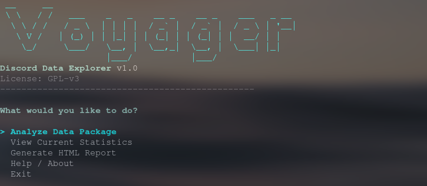

# Discord Voyager CLI



A high-performance, cross-platform tool to analyze your Discord Data Package.
Generates beautiful, interactive HTML reports from your local data.

## Features

-   **Privacy First**: Runs entirely locally. No data uploaded.
-   **Cross-Platform**: Windows, Linux, macOS.
-   **Fast**: Processes gigabytes of data in seconds using C#.

## Prerequisites

To use this tool, a Discord Data Package is required.

1.  Open Discord settings.
2.  Navigate to **Privacy & Safety**.
3.  Scroll down to "Request Data".
4.  Select "Messages" (other items are optional) and click **Request Data**.
5.  Wait for the email from Discord containing the download link.
6.  Download the `.zip` file. (Do not extract if using the Zip mode).

## Installation

### Option 1: Binary (Recommended)
Download the latest release for your platform and run it.

### Option 2: Build from Source
Requirements: .NET 8.0 or later.

```bash
cd DiscordVoyagerCLI
dotnet publish -c Release -r linux-x64 --self-contained
```

## Usage

Run the tool against your Discord Data Package (`.zip` or unzipped folder):

```bash
# Using the binary
./showcase /path/to/package.zip

# Or running from source
dotnet run -- /path/to/package.zip
```

The tool will generate a `voyager_report.html` file in your current directory. Open it in any web browser to view your stats.

## License

GPLv3
